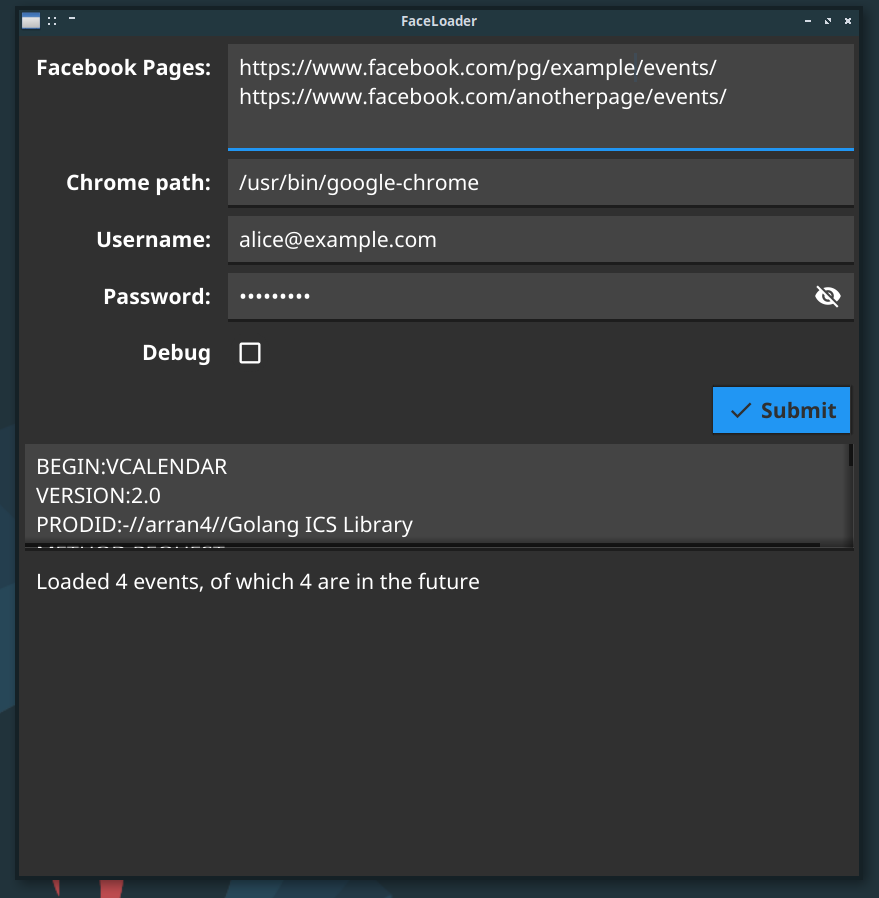

# Faceloader

[](https://github.com/geeksforsocialchange/faceloader/releases)
[](https://github.com/geeksforsocialchange/faceloader/actions)
[](https://golang.org/)

A simple gui application to create ical files with events from Facebook pages.

This is still a very early version, it may include bugs. Please report any issues you come across

## Why did we make FaceLoader?

Facebook has all but made it impossible for community groups to sync their data outside the platform. Where there was once multiple 'facebook to google cal' extensions and an open and easy-to-use API, now there's a big business only service that's been closed to new applications since the beginning of the Covid pandemic. Site crawling is actively discouraged through blocking requests from data centres and silently hiding future events for accounts that are not logged in. While there is a "download my data" option for personal pages, this is completely unsuitable for simple data sync of public data.

This is a pain in the butt for event promoters and community group organisers. Anyone who wants to both use Facebook to engage with an audience, and have this information to be available in other formats, currently only has the option of doing this manually with cut and paste. Facebook as an events platform has many desirable features such as easily allowing multiple event hosts, having events visible on more than one Page, and generally the social features that are really helpful for running an event.

### Our solution

While Facebook constantly shift the goalposts to stop easy interoperability, there is one thing they haven't yet blocked: using the accessible version of their website to view your own events.

FaceLoader is a desktop app that takes the name of one or more Facebook pages and then pretends to be you by visiting each event link and downloading the data to your local computer. This creates local files on your computer you can upload into other event platforms, as well as importing the files into your Google or Outlook Calendar.

FaceLoader was designed primarily to be used with the PlaceCal event aggregation platform, which requires a public iCal feed or API to operate. We developed FaceLoader out of frustration with Facebook's insistence on making interoperability a total pain in the butt.

## Installation

Most users will want to download the [latest release](https://github.com/geeksforsocialchange/faceloader/releases/latest). We provide ready-built versions for:

* Apple Mac (faceloader-mac.zip)
* Linux (faceloader.tar.xz)
* Windows (faceloader.exe)

Developers and people who want the absolutely latest version can get the sourcecode from git and run it that way:

```
git clone https://github.com/geeksforsocialchange/faceloader
cd faceloader
go run .
```

## Usage



1. Add all the Facebook event pages that you want to load events from, making sure you give just the page name from the url, not the full url (see the screenshot)
2. Set a directory to write the ics calendar file to
3. Press "Submit" and be patient

The settings will be saved, a list of discovered events will be shown, and the events will be written to files

If you leave the application running in the background, it will continue to update the ics event files every hour (you must submit the form if you make any changes to the list of facebook pages)

### Using the ics files

The ics files that are generated include the next five events listed on each given Facebook page. You can open these in your favourite calendar application (Outlook, Google Calendar, etc.)

If you want to share them more publicly, you can do so using [Dropbox](https://help.dropbox.com/files-folders/share/view-only-access) or [Google Drive](https://www.google.com/drive/download/)

## Development

Use [Conventional Commits](https://www.conventionalcommits.org/en/v1.0.0/) when writing your commit messages

To release, create and push a new tag. GitHub Actions will perform a release for you.
